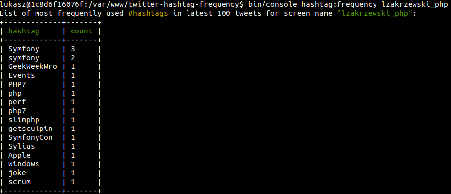

# twitter-hashtag-frequency

[](https://travis-ci.org/lzakrzewski/twitter-hashtag-frequency)  

CLI tool for listing most frequently used `#hashtags` in latest 100 tweets for given screen name.

## Requirements
```json
  "require": {
    "php": ">=7.0",
    "symfony/console": "~3.1",
    "guzzlehttp/guzzle": "~6.0"
  },
```


## Installation
Clone repository
```sh
git clone git@github.com:lzakrzewski/twitter-hashtag-frequency.git
```

Go to repository folder and then install composer dependencies
```sh
cd twitter-hashtag-frequency && composer install --no-dev
```

## Usage
CLI command needs to have one argument with screen name provided.

#### Example
```sh
bin/console hashtag:frequency lzakrzewski_php
```

#### Example output


## See also
- [Usage with `Docker`](doc/usage-with-docker.md)