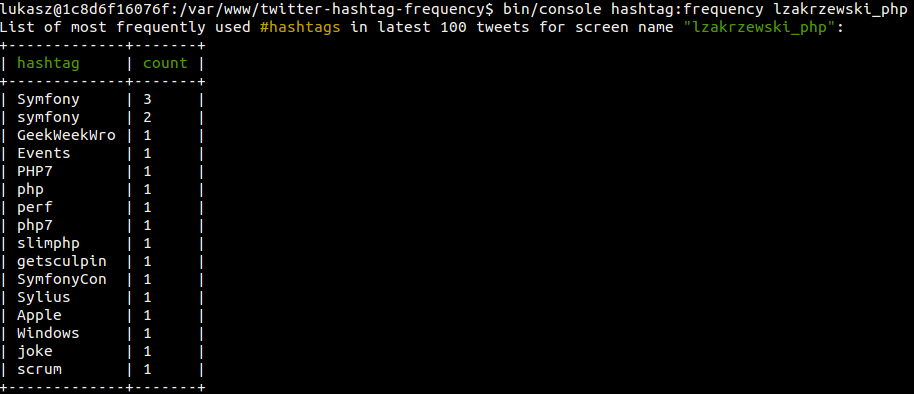

# Usage with `Docker`

There is prepared `Dockerfile` and `Makefile` for users who don't want to install `php7` natively.

#### Example
```sh
make hashtag-frequency lzakrzewski_php
```

#### Example output
